# Usage Guide

## Get Started

Thanks for using our theme!

To set up the theme exactly like our demo stores, you may need to install the our free app **[PapaThemes Widgets](https://www.bigcommerce.com/apps/papathemes-widgets/)**. This app provides additional widgets to build the content in Page Builder visually without coding skill. 

For displaying your Instagram photos on your website, you can use our free tool **[PapaThemes Instagram](https://instagram.papathemes.com/)**. We will guide you step by step later in this manual.

### Customizing Typography, Fonts and Colors

Customizing Typography, Fonts and Colors, Buttons in **Page Builder** > **Theme Styles** > **General**. There are dozens of options to help you customize your website beautifully and uniquely.

### Customizing Checkout Page's Typography and Colors

Customizing the checkout page's typography and colors in **Page Builder** > **Theme Styles** > **Optimized Checkout**

### Installing PapaThemes Widgets App

Find and install **[PapaThemes Widgets](https://www.bigcommerce.com/apps/papathemes-widgets/)** app from [BigCommerce Apps Marketplace](https://www.bigcommerce.com/apps/).

After installed, go to your admin page, on the left sidebar, click **Apps** >** My Apps**, click **Launch** button of PapaThemes Widgets app to open the app:

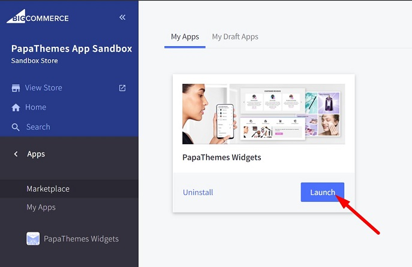

Then click the Install buttons in turn to install all available widgets:

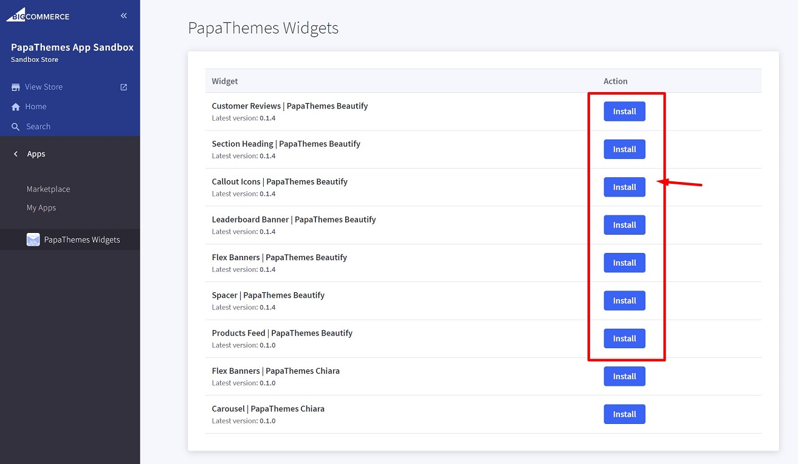

Go to **Storefront** > **My Themes** > click **Customize** in dropdown menu of Kansha theme to open Page Builder. Select any theme style to start:

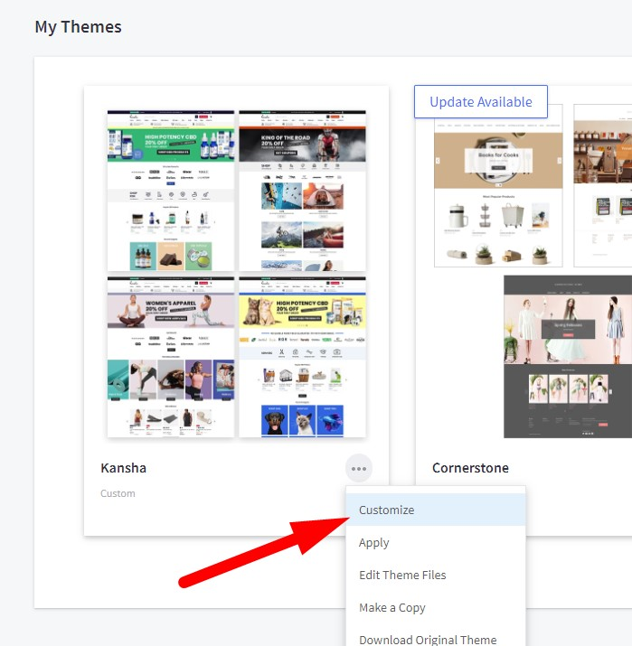

Verify the widgets installed successfully if they appear in Page Builder:


## Setting Up Pets Style Home Page

To start customizing the theme, login to your admin panel, go to **Storefront** > **My Themes**, click **Customize** button next to theme thumbnail.

### Header

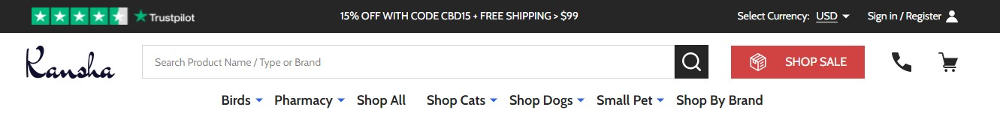


To configure the header, click on **Theme Styles** > **Header** section, here you can configure the header colors, store logo position and size.

**User Navigation** allows to change colors of the icon phone, cart.

**Top Bar** section allows to change color of this top bar.

**Main Navigation** allows to customize this navigation bar like changing the menu type to column, dropdown menu or mega menu; changing colors of the top menu as well as the sub-menus. There is an option "**Hide webpage links**" that allows to hide the static web page links on the main navigation.

**Quick Search** allows to change the colors of the search form.

**Watch the instruction video:**

<iframe width="560" height="315" src="https://www.youtube.com/embed/H-c-oUQycgg" title="YouTube video player" frameborder="0" allow="accelerometer; autoplay; clipboard-write; encrypted-media; gyroscope; picture-in-picture" allowfullscreen></iframe>


### Top Banner

The top banner can be created in **Marketing** > **Banners**, click **Create a Banner** button, enter Banner Name, Banner Content, select Show on Page = Home Page, select Location = Top of Page.

Go back to **Storefront** > **My Themes** > click **Customize** button beside the theme thumbnail. You can see the top banner appears above the header. To change the colors of the top banner, go to **Theme Styles** > **General** > **Top banners** section. Here you can change the text color and the background color.

**Watch the instruction video:**

<iframe width="560" height="315" src="https://www.youtube.com/embed/AWPZNKszf6w" title="YouTube video player" frameborder="0" allow="accelerometer; autoplay; clipboard-write; encrypted-media; gyroscope; picture-in-picture" allowfullscreen></iframe>

### Ad Banner displays on all pages

To display the ad banner appearing on all pages on the header, drag and drop the HTML widget to the corresponding position, paste the given code below to the HTML editor, then click Save HTML button.

```html
<p data-marquee>
  15% OFF WITH CODE CBD15 + FREE SHIPPING > $99. USE IT NOW.
</p>
```

The code allows to animate the text sliding from left to right on smaller screen.

**Watch the instruction video:**

<iframe width="560" height="315" src="https://www.youtube.com/embed/gG1WesJPkkk" title="YouTube video player" frameborder="0" allow="accelerometer; autoplay; clipboard-write; encrypted-media; gyroscope; picture-in-picture" allowfullscreen></iframe>


### Trustpilot rating image

To create TrustPilot rating image, in Page Builder, drag and drop the **Callout icons widget** to the corresponding position. Select **Icon** = `Choose image`, then upload your image here. Enter icon size accordingly, for example 217 x 24. Unselect **Display icons in container div**, Hide **Show text**. In **Padding** panel, enter 0 for all.

**Watch the instruction video:**

<iframe width="560" height="315" src="https://www.youtube.com/embed/ex3Ub0tC04U" title="YouTube video player" frameborder="0" allow="accelerometer; autoplay; clipboard-write; encrypted-media; gyroscope; picture-in-picture" allowfullscreen></iframe>


### Shop Sale button

To create the Shop Sale button, in Page Builder, drag and drop the **Callout icons widget** to the corresponding position. Delete all other items except the first one. Choose a certain icon, enter the text Shop Sale. Choose **Style** = `Left`, **Theme Style** = `custom`. Enter **font size** = 14px. Enter **icon size** 24 x 24 px.

Edit the layout column, change the **padding** to 0 and **margin left** = `30`. Then change the column background color to any color you want.

Click the Shop Sale widget again. Change the **padding** to 0 and to change the **icon color** and the **text color** to white.

**Watch the instruction video:**

<iframe width="560" height="315" src="https://www.youtube.com/embed/_cYlNVVxjoY" title="YouTube video player" frameborder="0" allow="accelerometer; autoplay; clipboard-write; encrypted-media; gyroscope; picture-in-picture" allowfullscreen></iframe>


### 4 Callout icons

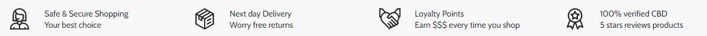

To create 4 callout icons, in Page Builder drag and drop the **Callout icons widget** to the position below the header. Delete all other items except the first one.

Choose the icon you like in **Icon**. Enter **icon size** 24 x 24px. Choose **Text style** = `Custom` and **font size** = `14px`, **text color** = `#262626`, **text color hover** = `#3162df`. Select **Show second text**, select **Hide on mobile** to hide the second text on mobile. Choose **font size** = `14px`. Colors are the same the first text line.

Change **Style** = `Left`, then edit the text directly in page builder. Change **padding** to `15 5 15 5` for desktop and tablet, `10 5 10 5` for mobile. Then duplicate to 4 items and choose different icons for the other items.

To change the background color, edit the layout, set Layout Background to a certain color that you want.

**Watch the instruction video:**

<iframe width="560" height="315" src="https://www.youtube.com/embed/h4zW6W1KvNQ" title="YouTube video player" frameborder="0" allow="accelerometer; autoplay; clipboard-write; encrypted-media; gyroscope; picture-in-picture" allowfullscreen></iframe>


### Ad Banner below the header displays on all pages

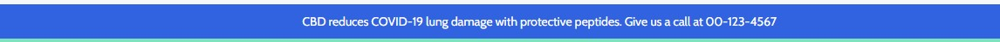

To create ad banner below the header appearing on all pages, drag & drop to **Text** widget to the corresponding position. Edit the text as you want. Choose **font size** = `14px`, **color** = `#ffffff`, **align** = `center`, **padding** = `8 0 8 0`.

Change the **layout background color** = `#3162df` or any color you want.

**Watch the instruction video:**

<iframe width="560" height="315" src="https://www.youtube.com/embed/T8nu-5BPcYs" title="YouTube video player" frameborder="0" allow="accelerometer; autoplay; clipboard-write; encrypted-media; gyroscope; picture-in-picture" allowfullscreen></iframe>


### Main carousel

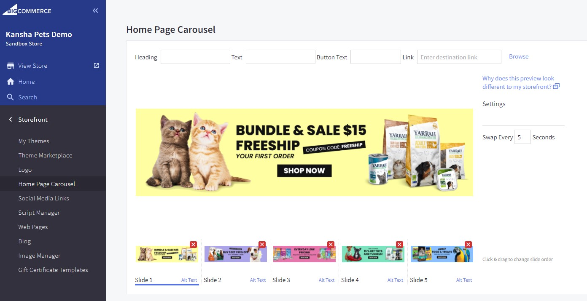

Upload the carousel images in **Storefront** > **Home Page Carousel**.

Go back to **Page Builder**, in **Theme Styles** > **Home Page**, make sure **Carousel** > **Show carousel** is selected. You can change the carousel styles and colors here.

**Watch the instruction video:**

<iframe width="560" height="315" src="https://www.youtube.com/embed/HT44vYYQbnM" title="YouTube video player" frameborder="0" allow="accelerometer; autoplay; clipboard-write; encrypted-media; gyroscope; picture-in-picture" allowfullscreen></iframe>


### Brand logos 

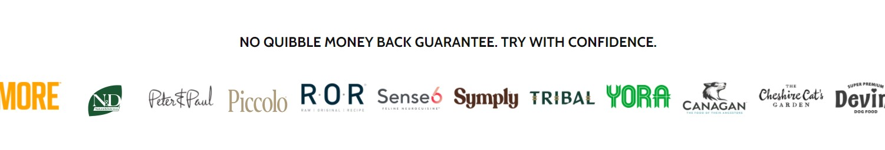

To display the brand images on the home page, in Page Builder, drag & drop the **Flex Banners | PapaThemes Beautify** to the corresponding position, delete all other banner items except the first item.

Upload the image in **Image** field, and enter the **image width** & **height** accordingly (for example 150 x 80 px). Change **Border radius** = `0`. In **Content** group, Hide **Heading text**.

In **General** group, choose **Width** = `%` and set **Value (Desktop)** = `8.33%`, **Value (Tablet)** = `16.66%`, **Value (Mobile)** = `33.33%` to display 12 images per row on desktop, 6 images per row on tablet and 3 banners per row on mobile. In **Padding** panel, set `5` for all values. Unselect **Display banners in container div** to display full width.

Duplicate to 12 banners and upload images accordingly for each banner.

To display the title, using drag & drop the **Section Heading | PapaThemes Beautify** widget to the corresponding position above the brand widget. Set **Padding** = `60 0 40 0`, and **Padding (Mobile)** = `40 0 20 0` as suggested.

Optionally adding a extra spacing below the brand images using **Spacer | PapaThemes Beautify** widget, set **Desktop** = `50px`, **Tablet** = `30px` and **Mobile** = `30px`.

**Watch the instruction video:**

<iframe width="560" height="315" src="https://www.youtube.com/embed/StgI5Ns3rWA" title="YouTube video player" frameborder="0" allow="accelerometer; autoplay; clipboard-write; encrypted-media; gyroscope; picture-in-picture" allowfullscreen></iframe>


### Service icons

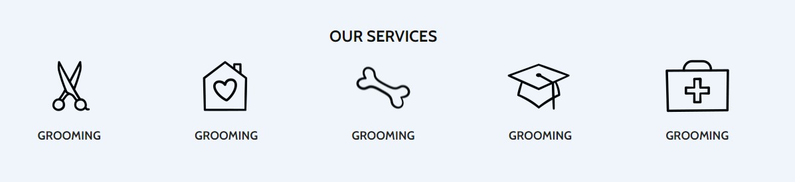

Drag & drop the **Layout** to the corresponding position, change **Padding** = `30 10.5 40 10.5`. Change the **Layout background color** to `#EFF5FA`.

Drag & drop the **Callout Icons** widget to the layout. Delete all other items except the first one.

Select **Icon** = `Choose Image`, then upload your icon image. Set Icon width & height accordingly (example 100 x 100 px).

Set **Width** = `20%` for desktop, `20%` for tablet and `33.33%` for mobile to display 5 icons on desktop and tablet and 3 icons per row on mobile.

Set **Padding**, **Desktop** = `10 5 30 5`, **Tablet** = `10 5 30 5`, **Mobile** = `10 5 15 5`.

Set Text **font size** = `18px`, **font size (mobile)** = `16px`. **Text color** = `#262626`.

Duplicate the icons to 5 icons and choose different image for each icon.

To add the title, drag & drop the **Section Heading | PapaThemes Beautify** widget to above the icons. Set **Padding** = `40 0 0 0` and **Padding (Mobile)** = `20 0 10 0`.

**Watch the instruction video:**

<iframe width="560" height="315" src="https://www.youtube.com/embed/DItG-eoAnew" title="YouTube video player" frameborder="0" allow="accelerometer; autoplay; clipboard-write; encrypted-media; gyroscope; picture-in-picture" allowfullscreen></iframe>


### Category banners

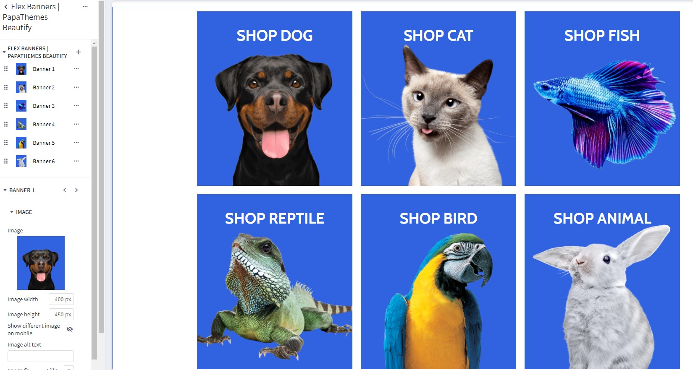

Drag & drop the **Flex Banners | PapaThemes Beautify** widget to the corresponding position. Delete all other banners except the first one.

Upload your image in **Image** field. Set **Image Width** and **height** accordingly (our suggested size: 400x450px). Change **Border radius** = `0`.

In **Content** group, change **content align** to `center` & `top`. **Content pading** = `30 30 30 30`.

In **Heading text** panel, Choose **Text style** = `custom`, set **Font weight** = `Semi Bold`, **Font size** = `36px`, **Font size (mobile)** = `16px`, **Text color** = **Text color hover** = `#ffffff`, **Text color (mobile)** = **Text color hover (mobile)** = `#262626`.

In **General** group:

- In **Width** panel, set **Width** = `%` and **Value (Desktop)** = **Value (Tablet)** = `33.33%`, **Value (Mobile)** = `50%` to display 3 banners per row on desktop & tablet and 2 banners per row on mobile. 
- In **Padding** panel, set **Desktop** = **Tablet** = `10 10 10 10`, **Mobile** = `5 5 5 5`.

Duplicate to 6 banners and upload different image for each banner.

**Watch the instruction video:**

<iframe width="560" height="315" src="https://www.youtube.com/embed/DKxxYwLdREU" title="YouTube video player" frameborder="0" allow="accelerometer; autoplay; clipboard-write; encrypted-media; gyroscope; picture-in-picture" allowfullscreen></iframe>


### FAQs content section

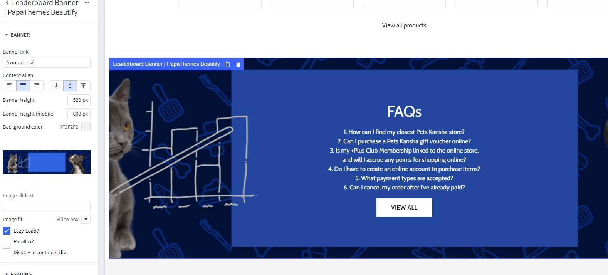

Drag & drop **Leaderboard Banner | PapaThemes Beautify** widget to the corresponding position. 

Upload image in **Image** field and enter **Banner height** accordingly (we suggest 520px for desktop and 600px for mobile).

Enter **banner link**, for example `/faq/`. Set **Content align** = `center` & `middle`.

In **Heading** group, Set **font size** = `40px`, **Heading color** = **Heading color (mobile)** = `#ffffff`.

In **Text** group, Set **Font size** = `16px`, **Text color** = **Text color (mobile)** = `#ffffff`.

In **Button** group, Set **Button style** = `Custom`, **Button radius** = `0`, **Button color** = `#ffffff`, **Button color hover** = `#111111`, **Button text color** = `#111111`, **Button text color hover** = `#ffffff`.

Edit content directly in Page Builder.

**Watch the instruction video:**

<iframe width="560" height="315" src="https://www.youtube.com/embed/9jWhrCYXi5o" title="YouTube video player" frameborder="0" allow="accelerometer; autoplay; clipboard-write; encrypted-media; gyroscope; picture-in-picture" allowfullscreen></iframe>


### Featured products

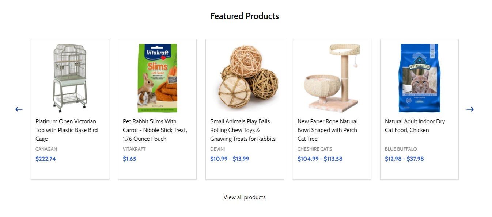

You can set featured products in **Products**, click the **star** icon on the same row to set the product as featured.

Go back to **Page Builder** > **Theme Styles** > **Home Page**, make sure one of the **Sections** field has **Featured Products** selected. In **Featured products** section, you can change the **Heading**, **Number of products** to display, Number of product per row (**Columns**), changing **Display type** to `Carousel` or `Grid`, changing the **background color**, editing the link of **View all products**.

**Watch the instruction video:**

<iframe width="560" height="315" src="https://www.youtube.com/embed/9sfuY8RwGI8" title="YouTube video player" frameborder="0" allow="accelerometer; autoplay; clipboard-write; encrypted-media; gyroscope; picture-in-picture" allowfullscreen></iframe>

### New products

You can configure new products section settings in **Page Builder** > **Theme Styles** > **Home Page**, make sure one of the **Sections** field has **New Products** selected. In **New products** section, you can change the **Heading**, **Number of products** to display, Number of product per row (**Columns**), changing **Display type** to `Carousel` or `Grid`, changing the **background color**, editing the link of **View all products**.

### Bestselling products

Bestselling products only display when your store has some order.

You can configure bestselling products section settings in **Page Builder** > **Theme Styles** > **Home Page**, make sure one of the **Sections** field has **Popular Products** selected. In **Best-sellers products** section, you can change the **Heading**, **Number of products** to display, Number of product per row (**Columns**), changing **Display type** to `Carousel` or `Grid`, changing the **background color**, editing the link of **View all products**.

### Customer reviews

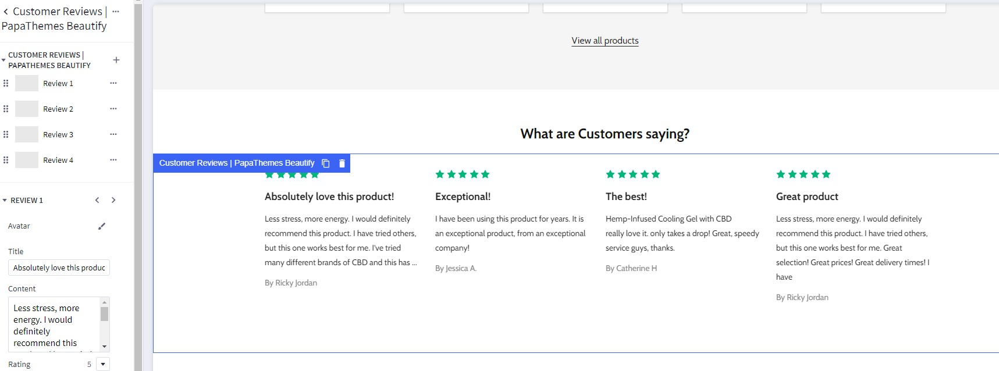

To display the customer reviews on the home page, drag & drop the **Customer Reviews | PapaThemes Beautify** widget to the corresponding position. You can edit the title, content, author directly in the Page Builder.

Select **Style for theme** = `Beautify Furniture` to display the style like our demo store.

To create the title, drag & drop the **Section Heading | PapaThemes Beautify** widget to above the reviews. Set **Padding** = `60 0 20 0` and **Padding (Mobile)** = `40 0 10 0`.


### Instagram photos

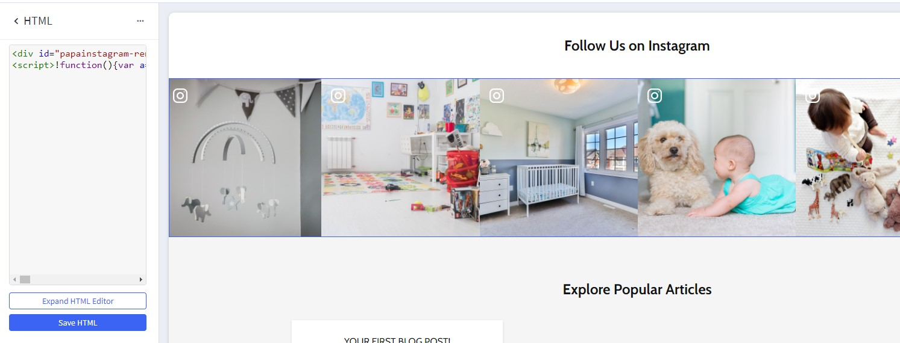

To display your Instagram photos, open <https://instagram.papathemes.com/> Follow the instruction on this page to [Connect your Facebook Page with your Instagram account](https://www.facebook.com/business/help/898752960195806). Then click **Login With Facebook** button and follow the further steps to authorize access permission. Click **Show Embedding Code** button to generate the code embedding to your web store. Choose **Preset** = `Carousel` and select **LazyLoad**.

Copy all the code appear in Step 1 & Step 2. For example:

```html
<script>!function(){var a=document.createElement("script");a.defer=!0,a.src="https://papathemes.s3.amazonaws.com/instagramapp/assets/js/embed-1.0.1.js",a.onload=function(){PapathemesInstagramApp.init({account_id:"****************",element_id:"papainstagram-render",limit:"20",preset:"grid",lazyload:"false"})},document.body.appendChild(a)}();</script>

<div id="papainstagram-render"></div>
```

Go back to your store Page Builder. Drag & drop the HTML widget to the corresponding position. Paste the generated code above to the HTML editor, and click **Save HTML** button. Your Instagram photos should display like our demo store.

Please note that the app only updates your latest uploaded photos every 6 hours.

To create the title, drag & drop the **Section Heading** widget to above the Instagram photos. Set **Padding** = `40 0 40 0` and **Padding (Mobile)** = `20 0 20 0`.

**Watch the instruction video:**

<iframe width="560" height="315" src="https://www.youtube.com/embed/H_JSLYDae1M" title="YouTube video player" frameborder="0" allow="accelerometer; autoplay; clipboard-write; encrypted-media; gyroscope; picture-in-picture" allowfullscreen></iframe>


### Recent blog posts

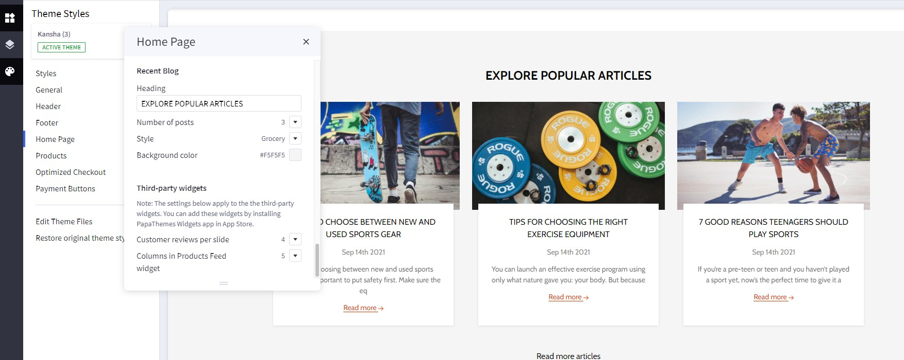

You can add blog posts in Storefront > Blog. Click the **+** button to add a new blog post. Make sure **Blog Visibility** is `on`.

To display the recent blog posts on the home page, go to Page Builder. In Theme Styles > Home Page, make sure one of Sections has **Recent Blog** selected. Scroll down the Recent Blog section, you can configure **Heading**, **Number of posts** to display. Select **Style** = `Grocery` to display like our demo store. You can change the **Background color** = `#f5f5f5` or any color you want.

**Watch the instruction video:**

<iframe width="560" height="315" src="https://www.youtube.com/embed/QP6y5tXJyko" title="YouTube video player" frameborder="0" allow="accelerometer; autoplay; clipboard-write; encrypted-media; gyroscope; picture-in-picture" allowfullscreen></iframe>


### Newsletter

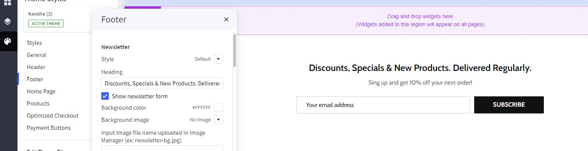

To enable newsletter form, go to **Marketing** > **Email Marketing**, make sure **Allow Newsletter Subscriptions** is checked. Optionally select **Show Newsletter Summary** and enter the summary text as you want.

Go to Page Builder, in **Theme Styles** > **Footer** > **Newsletter** section, select **Style** = `Default`. Make sure **Show newsletter form** is selected. You can change the **Heading**, **background color**, **background image**, **button** and **text colors**.

**Watch the instruction video:**

<iframe width="560" height="315" src="https://www.youtube.com/embed/gdclE36uP_k" title="YouTube video player" frameborder="0" allow="accelerometer; autoplay; clipboard-write; encrypted-media; gyroscope; picture-in-picture" allowfullscreen></iframe>


### Footer

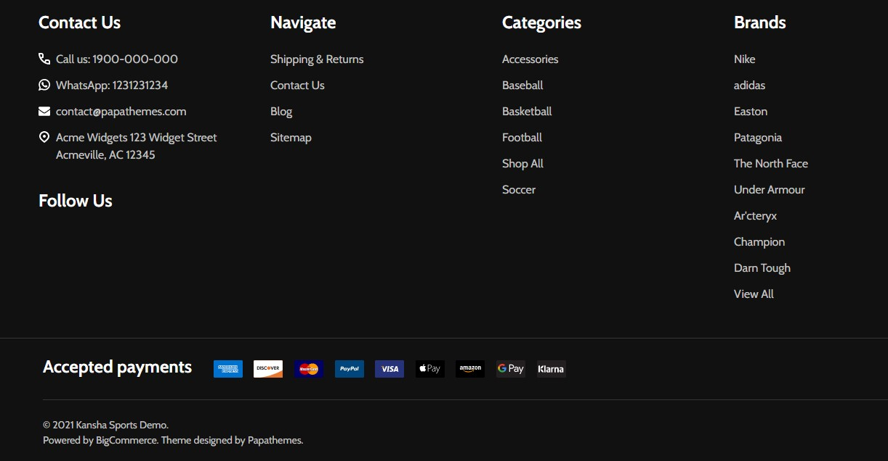

In **Page Builder** > **Theme Styles** > **Footer**, you can configure the newsletter form appearance in **Newsletter** section, configure the footer link colors in **Main Footer** section, displaying store logo, contact info, store address,... **Show pages** allows to limit number of web page links to display. **Show categories** allows to limit number of category links to display. Similarly for **Show brands** option.

**Payment Icons** allows to select which payment icons to display.

**Copyright** allows to configure the copyright text.

**Watch the instruction video:**

<iframe width="560" height="315" src="https://www.youtube.com/embed/CDa7Z-YijUQ" title="YouTube video player" frameborder="0" allow="accelerometer; autoplay; clipboard-write; encrypted-media; gyroscope; picture-in-picture" allowfullscreen></iframe>


#### Add custom links to the footer

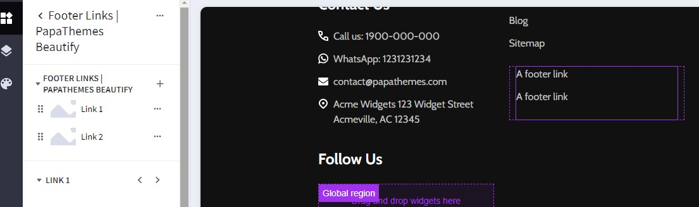

You can add custom links to the footer using **Footer Links** widget. Drag & drop the widget to the corresponding position. Edit the links directly in Page Builder.

**Watch the instruction video:**

<iframe width="560" height="315" src="https://www.youtube.com/embed/CDa7Z-YijUQ?start=29" title="YouTube video player" frameborder="0" allow="accelerometer; autoplay; clipboard-write; encrypted-media; gyroscope; picture-in-picture" allowfullscreen></iframe>


## Setting Up CBD Style Home Page

### General

You can read these common instructions in **Setting Up Pets Style Home Page** chapter:

- [Header](#header)
- [Top Banner](#top-banner)
- [Ad Banner displays on all pages](#ad-banner-displays-on-all-pages)
- [Trustpilot rating image](#trustpilot-rating-image)
- [Shop Sale button](#shop-sale-button)
- [4 Callout icons](#4-callout-icons)
- [Ad Banner below the header displays on all pages](#ad-banner-below-the-header-displays-on-all-pages)
- [Main carousel](#main-carousel)
- [Service icons](#service-icons)
- [Category banners](#category-banners)
- [Featured products](#featured-products)
- [New products](#new-products)
- [Bestselling products](#bestselling-products)
- [Customer reviews](#customer-reviews)
- [Instagram photos](#instagram-photos)
- [Recent blog posts](#recent-blog-posts)
- [Newsletter](#newsletter)
- [Footer](#footer)


### Featured in logos

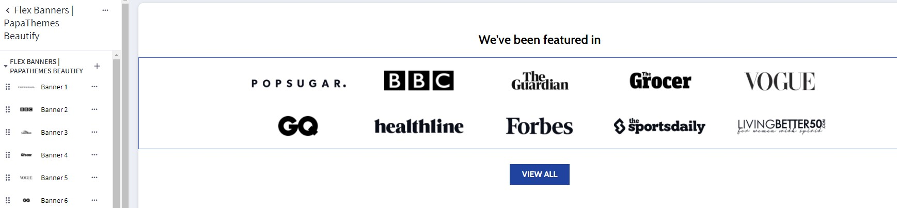

In Page Builder, drag & drop **Flex Banners | PapaThemes Beautify** widget to the corresponding position. Delete all items except the first one. 

Edit the first banner, upload your image in **Image** field. Enter **Image width** and **Image height** accordingly. Set Border radius = 0.

In **Content** group, Click the eye icon next to **Heading text** to hide it.

In **General** group:

- Click the pencil icon next to Width to open the Width configuration panel. Set **Width** = `%`, **Value (Desktop)** = `20%`, **Value (Tablet)** = **Value (Mobile)** = `33.33%` to display 5 images per row on desktop and 3 images per row on mobile & tablet.
- Click the pencil icon next to **Padding** to open the Padding configuration panel. Set **Desktop** = `20 0 20 0`, **Tablet** = **Mobile** = `10 0 10 0`.

Duplicate to 10 items and change different image for each item.

To display the title, drag & drop the **Section Heading** widget to above the images. Set **Padding** = `60 0 20 0` and **Padding (Mobile)** = `30 0 15 0` and edit the content directly in Page Builder.

Drag & drop the **Spacer | PapaThemes Beautify** widget to below the images and set **Desktop** = `30px`, **Tablet** = `10px`, **Mobile** = `10px`.

Drag & drop the **Button** widget to below the spacer, Set **Padding** = `8 24 8 24`. Enter **Button link** as you want. In **Text** group, set **Font size** = `16px`, **Text color** = **Text color (hover)** = `#ffffff`. In **Style** group, change **Button color** = **Border color** = #1f439e, **Button color (hover)** = **Border color (hover)** = `#0f0f2d`, **Border thickness** = `0`.

Drag & drop the **Spacer | PapaThemes Beautify** widget to below the button and set **Desktop** = `60px`, **Tablet** = `40px`, **Mobile** = `20px`.

**Watch the instruction video:**

<iframe width="560" height="315" src="https://www.youtube.com/embed/cQ6XVLFIRv0" title="YouTube video player" frameborder="0" allow="accelerometer; autoplay; clipboard-write; encrypted-media; gyroscope; picture-in-picture" allowfullscreen></iframe>


### FAQ sections


Drag & drop **Hero Banner** widget to the corresponding position. Enter **Banner link** as you want. Set **Content align** = `Left`. **Banner size** = `Medium`. **Background** = `Image` and upload the image you want to display. Set **Image fit** = `Fill to box`, **Image parallax** = `Off`. **Image align** = `center` & `middle`.

In **Text** group, choose showing **Title** and **Description**. Set Title **Font Size** = `40px` and Description **Font size** = `16px`. **Text color** = `#ffffff`, **Text color (mobile)** = `#0f0f2d`.

In **Button** group, choose showing **Button**. Set **button style** = `Square`, **Button color** = **Button color (mobile)** = `#1f439e`.

**Watch the instruction video:**

<iframe width="560" height="315" src="https://www.youtube.com/embed/SMpiKYIkrIs" title="YouTube video player" frameborder="0" allow="accelerometer; autoplay; clipboard-write; encrypted-media; gyroscope; picture-in-picture" allowfullscreen></iframe>

## Setting Up Yoga Style Home Page

### General

You can read these common instructions in **Setting Up Pets Style Home Page** chapter:

- [Header](#header)
- [Top Banner](#top-banner)
- [Ad Banner displays on all pages](#ad-banner-displays-on-all-pages)
- [Trustpilot rating image](#trustpilot-rating-image)
- [Shop Sale button](#shop-sale-button)
- [4 Callout icons](#4-callout-icons)
- [Ad Banner below the header displays on all pages](#ad-banner-below-the-header-displays-on-all-pages)
- [Main carousel](#main-carousel)
- [Service icons](#service-icons)
- [Category banners](#category-banners)
- [Featured products](#featured-products)
- [New products](#new-products)
- [Bestselling products](#bestselling-products)
- [Customer reviews](#customer-reviews)
- [Instagram photos](#instagram-photos)
- [Recent blog posts](#recent-blog-posts)
- [Newsletter](#newsletter)
- [Footer](#footer)

### Our brand logos

Please refer [Featured in logos setup instructions](#featured-in-logos) of **CBD Style**.

### Featured category banners

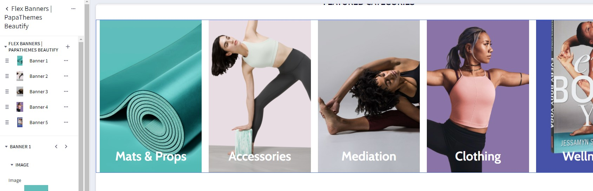

In Page Builder, drag & drop **Flex Banners | PapaThemes Beautify** widget to the corresponding position. Delete all items except the first one.

Edit the first banner, upload image in **Image** field and set **Image width**, **Image height** accordingly (our recommended size 400x600px). Change **Border radius** = `0`. Optionally enter the banner link in **Link** field.

In **Content** group:

- Set **Content align** = `center` & `bottom`.
- Click the pencil icon next to **Heading** text, set **Text style** = `custom`, **Font weight** = `bold`, **Font size** = `36px`, **Font size (Mobile)** = `16px`, **Text color** = **Text color hover** = `#ffffff`, **Text color (Mobile)** = **Text color hover (Mobile)** = `#262626`.

In **General** group:

- Click the pencil icon next to **Width** to open Width configuration panel. Set **Width** = `%`, **Value (Desktop)** = `20%`, **Value (Tablet)** = **Value (Mobile)** = `33.33%` to display 5 banners per row on mobile and 3 banners per row on mobile and tablet.
- Click the pencil icon next to **Padding** to open Padding configuration panel. Set **Desktop** = `0 10 0 10`, **Tablet** = `0 5 10 5`, **Mobile** = `0 5 15 0`.
- Unselect **Display banners in contain div** to display the banners full width.

Duplicate to 5 banners and change the image for each banner as you want.

To display the title, drag & drop Section **Heading widget** to above the banners. Edit the text directly in Page Builder.

**Watch the instruction video:**

<iframe width="560" height="315" src="https://www.youtube.com/embed/4DVaHsSvTag" title="YouTube video player" frameborder="0" allow="accelerometer; autoplay; clipboard-write; encrypted-media; gyroscope; picture-in-picture" allowfullscreen></iframe>


### Temperature Up banner

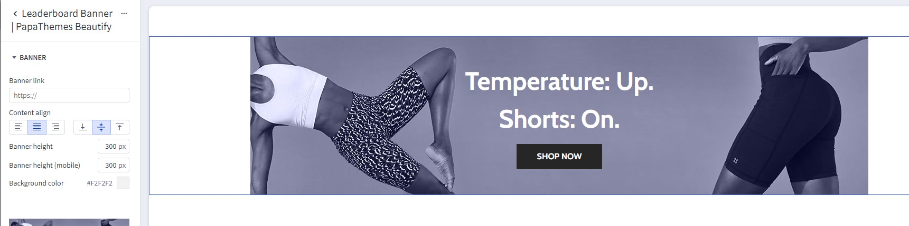

In Page Builder, drag & drop **Leaderboard Banner** widget to the corresponding position. Upload image in **Image** field and set **Banner height** = **Banner height (Mobile)** = `300px`. Optionally input **Banner link**.

In **Heading** group, **Show heading** = `on`, set **Heading style** = `Custom`, **Font size** = `48px`.

In **Button** group, set **Button** = `on`, **Button style** = `Custom`, **Button radius** = `0`, **Button color** = `#262626`, **Button color hover** = `#9597b4`, **Button text color** = **Button text color hover** = `#ffffff`.

**Watch the instruction video:**

<iframe width="560" height="315" src="https://www.youtube.com/embed/hD57F-3ENUU" title="YouTube video player" frameborder="0" allow="accelerometer; autoplay; clipboard-write; encrypted-media; gyroscope; picture-in-picture" allowfullscreen></iframe>


### Luxury yoga banner

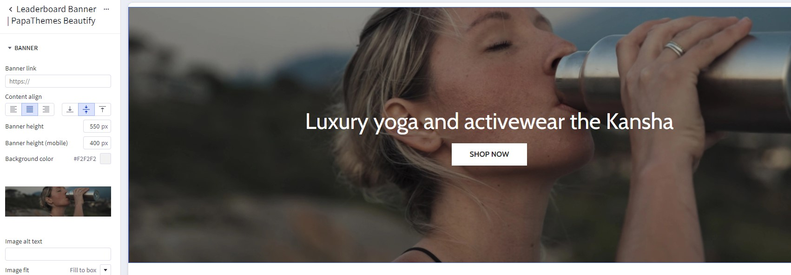

In Page Builder, drag & drop **Leaderboard Banner** widget to the corresponding position. Upload image in **Image** field and set **Banner height** = `550px`, **Banner height (Mobile)** = `400px`. Optionally input **Banner link**.

Deselect **Display in container div** to display the banner full width.

In **Heading** group, **Show heading** = `on`, set **Heading style** = `Custom`, **Font size** = `48px`, Heading color = Heading color (mobile) = #ffffff.

In **Button** group, set **Button** = `on`, **Button style** = `Custom`, **Button radius** = `0`, **Button color** = `#ffffff`, **Button color hover** = `#9597b4`, **Button text color** = `#262626`, **Button text color hover** = `#ffffff`.

**Watch the instruction video:**

<iframe width="560" height="315" src="https://www.youtube.com/embed/msOlPO5qWNQ" title="YouTube video player" frameborder="0" allow="accelerometer; autoplay; clipboard-write; encrypted-media; gyroscope; picture-in-picture" allowfullscreen></iframe>

## Setting Up Sport Style Home Page

### General

You can read these common instructions in **Setting Up Pets Style Home Page** chapter:

- [Header](#header)
- [Top Banner](#top-banner)
- [Ad Banner displays on all pages](#ad-banner-displays-on-all-pages)
- [Trustpilot rating image](#trustpilot-rating-image)
- [Shop Sale button](#shop-sale-button)
- [4 Callout icons](#4-callout-icons)
- [Ad Banner below the header displays on all pages](#ad-banner-below-the-header-displays-on-all-pages)
- [Main carousel](#main-carousel)
- [Featured products](#featured-products)
- [New products](#new-products)
- [Bestselling products](#bestselling-products)
- [Customer reviews](#customer-reviews)
- [Instagram photos](#instagram-photos)
- [Recent blog posts](#recent-blog-posts)
- [Newsletter](#newsletter)
- [Footer](#footer)

### Shop For icons

Please refer [Service icons setup instruction](#service-icons) in Pets Style Home Page.

### Our Brand logos

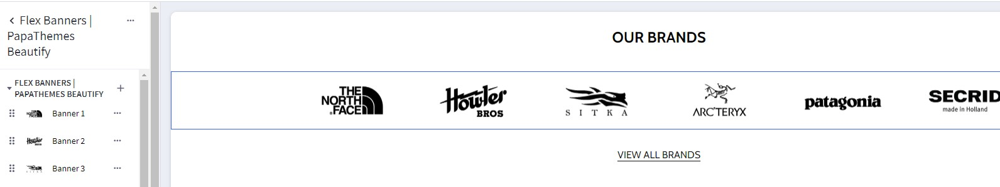

In Page Builder, drag & drop **Flex Banners | PapaThemes Beautify** widget to the corresponding position. Delete all items except the first one.

- Edit the first banner, upload your logo image in **Image** field. Set **Image width**, **Image height** accordingly (our recommended size 160x90px). Change **Border radius** = `0`.
- In **Content** group, Set **Heading text** = `off`.
- In **General** group:
  - Click the pencil icon next to **Width** to open Width configuration panel. Set **Width** = `%`, **Value (Desktop)** = `16.66%`, **Value (Tablet)** = **Value (Mobile)** = `33.33%` to display 6 images per row on desktop and 3 images per row on tablet and mobile.
  - Click the pencil icon next to **Padding** to open Padding configuration panel. Set **Desktop** = **Tablet** = `0 10 0 10`, **Mobile** = `5 5 5 5`.

- Duplicate the banner to 6 and upload different image for each banner as you want.

To display the title, drag & drop the **Section Heading** widget to above the logo images. Set **Padding** = `60 0 40 0`, **Padding (Mobile)** = `40 0 30 0` and edit the title text directly in Page Builder.

Drag & drop a **Spacer | PapaThemes Beautify** widget to below the logo images and set **Desktop** = `30px`, **Tablet** = `30px`, **Mobile** = `20px`.

Drag & drop a **Text** widget to below the spacer. Set **Text style** = `Custom`, **Font size** = `16px`, **Text color** = `#111111`, and edit the text and link directly in Page Builder.

**Watch the instruction video:**

<iframe width="560" height="315" src="https://www.youtube.com/embed/9eeJV3ksQmk" title="YouTube video player" frameborder="0" allow="accelerometer; autoplay; clipboard-write; encrypted-media; gyroscope; picture-in-picture" allowfullscreen></iframe>


### Category banners

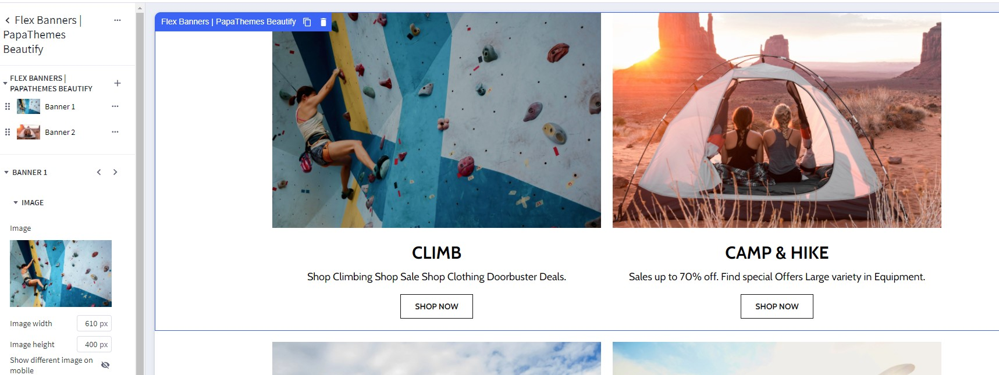

In Page Builder, drag & drop **Flex Banners | PapaThemes Beautify** widget to the corresponding position. Delete all items except the first one.

- Edit the first banner, upload your logo image in **Image** field. Set **Image width**, **Image height** accordingly (our recommended size 610x400px). Change **Border radius** = `0`.
- In **Content** group:
  - Set **Content align** = `center` & `bottom`.
  - Set **Content padding** = `20 20 20 20`.
  - show all **Heading text**, **Description text** and **Action button**.
- In **General** group:
  - Select **Style for theme** = `Kansha Sport`.
- Edit the text and button text directly in Page Builder.
- Duplicate the banner to 2 and upload different image for each banner.

**Watch the instruction video:**

<iframe width="560" height="315" src="https://www.youtube.com/embed/JiMCw4pPGuw" title="YouTube video player" frameborder="0" allow="accelerometer; autoplay; clipboard-write; encrypted-media; gyroscope; picture-in-picture" allowfullscreen></iframe>


### We're Here For You parallax banner

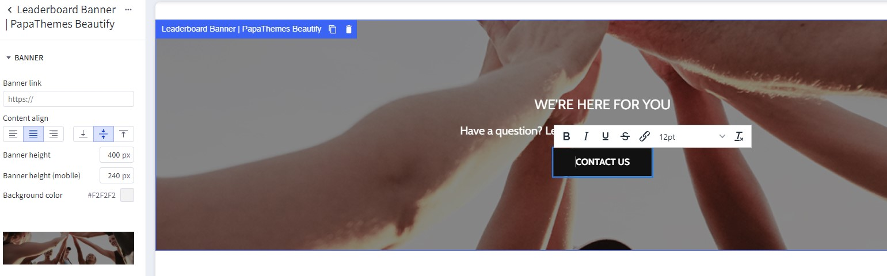

In Page Builder, drag & drop **Leaderboard Banner | PapaThemes Beautify** widget to the corresponding position.

- Upload image in **Image** field and set **Banner height** = `400px`, **Banner height (mobile)** = `240px`.
- Set **Content align** = `center` & `middle`.
- Optionally input **Banner link**.
- Tick on the **Parallax** checkbox.
- Un-tick **Display in container div** to display the banner image full width.
- In **Heading** group, set all colors to `#ffffff`.
- In **Text** group, set all colors to `#ffffff`.
- In **Button** group, set **Button style** = `Custom`, **Button radius** = `0`, **Button color** = `#ffffff`, **Button color hover** = `#111111`, **Button text color** = `#111111`, **Button text color hover** = `#ffffff`.
- Edit the text and button directly in Page Builder.

**Watch the instruction video:**

<iframe width="560" height="315" src="https://www.youtube.com/embed/8Z2ihKOfNCc" title="YouTube video player" frameborder="0" allow="accelerometer; autoplay; clipboard-write; encrypted-media; gyroscope; picture-in-picture" allowfullscreen></iframe>

### Featured video

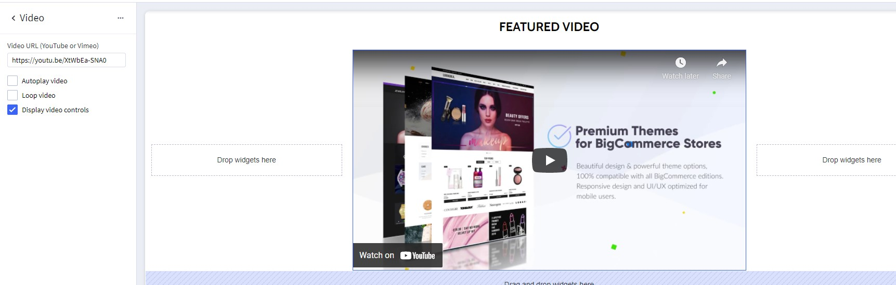

In Page Builder drag & drop **Layout** to the corresponding position and divide to 3 columns.

Drag & drop the **Video** widget to center column and enter your YouTube or Vimeo video link to **Video URL**.

To display the title, drag & drop **Section Heading | PapaThemes Beautify** widget to above the layout. Set **Padding** = `60 0 30 0`, **Padding (Mobile)** = `40 0 20 0`.

**Watch the instruction video:**

<iframe width="560" height="315" src="https://www.youtube.com/embed/Nzug892Ob6Q" title="YouTube video player" frameborder="0" allow="accelerometer; autoplay; clipboard-write; encrypted-media; gyroscope; picture-in-picture" allowfullscreen></iframe>


## Customizing Products Display

### Product Card

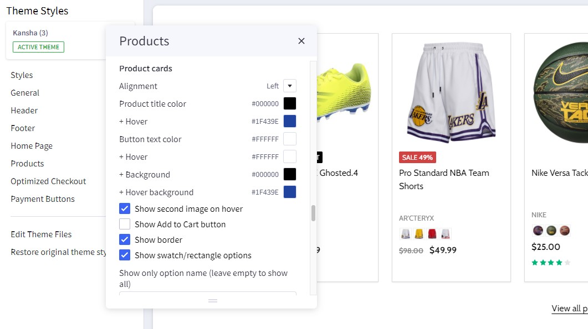

Configuring product cards in **Page Builder** > **Theme Styles** > **Products** > **Product cards**.

- **Alignment**: Specifying content alignment `left` or `center`.
- **Product title color**: Specifying the product name's color.
- + **Hover**: Specifying color when hover or focus.
- **Button text color**: Specifying the button text color.
- + **Background**: Specifying the button background color.
- + **Border**: Specifying the button border color.
- **Show second image on hover**: Displaying the second image when hover the product card.
- **Show border**: toggle displaying the product card border.
- **Show swatch/rectangle options**: Allows to display with swatch/rectangle type product option on every product card. It's helpful to display different product variants like colors or sizes.
- **Swatch sizes**: Specifying the swatch color/image size.
- **Badge position**: also to configure the sale badge position to `Top Left` or `Below image`.

### Displaying product price ranges

By default product price ranges is enabled. To turn off, Go to **Page Builder** > **Theme Styles** > **Products** > uncheck **Price ranges** checkbox.

**Show retail price**: Toggle displaying the product retail prices.


### Hiding prices for non logged in customers

To turn on this feature, go to **Page Builder** > **Theme Styles** > **Products** > tick **Restrict Purchase to Login** checkbox.


### Redirecting to cart page after product added to cart

By default the cart popup is displayed, if you want to take customer to the cart page instead, go to **Page Builder** > **Theme Styles** > **Products** > tick **Redirect to cart page after add to cart** checkbox.

### Showing/Hiding Quick-View button

By default quick-view buttons appear on all product cards. To hide it, go to **Page Builder** > **Theme Styles** > **Products** > un-tick **Show Quickview** checkbox.

### Showing/Hiding the quantity box on PDP

By default the quantity box shows up, to hide it, go to **Page Builder** > **Theme Styles** > **Products** > un-tick **Show quantity selection on product pages** checkbox.

### Customizing the popup displayed after product added to cart

In **Page Builder** > **Theme Styles** > **Products** > **Popup after added to cart**:

- `Default`: Displaying the large popup.
- `Mini`: Displaying a smaller popup that has auto close.
- `Cart Preview`: Displaying the whole shopping cart popup on the right side.
- `Hide`: Not show any popup.

Mini added to cart popup:

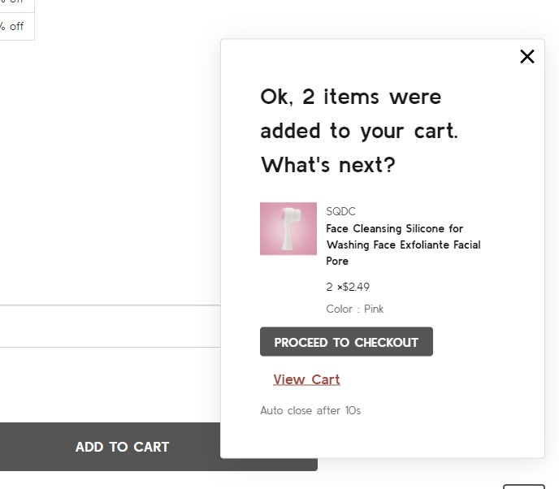

### Displaying Recently Viewed Products

Recently viewed products only display for logged-in customers.

To enable it, go to **Page Builder** > **Theme Styles** > **Products** > **Show recently viewed** select number of products to display.


### Customizing Price Labels

You can customize sale price label, before sale price label, retail price label or regular price label in 
**Page Builder** > **Theme Styles** > **Products** > **Price Labels**

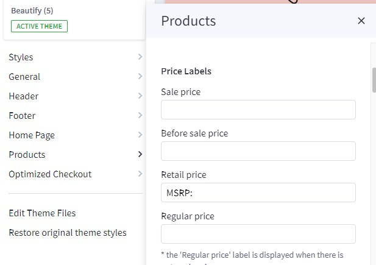

### Displaying product weight, dimensions on PDP

Go to **Page Builder** > **Theme Styles** > **Products** > **Product Page**.

- Tick **Show product weight** checkbox.
- Tick **Show product dimensions** checkbox.

### Display sale badge / in-stock badge on PDP

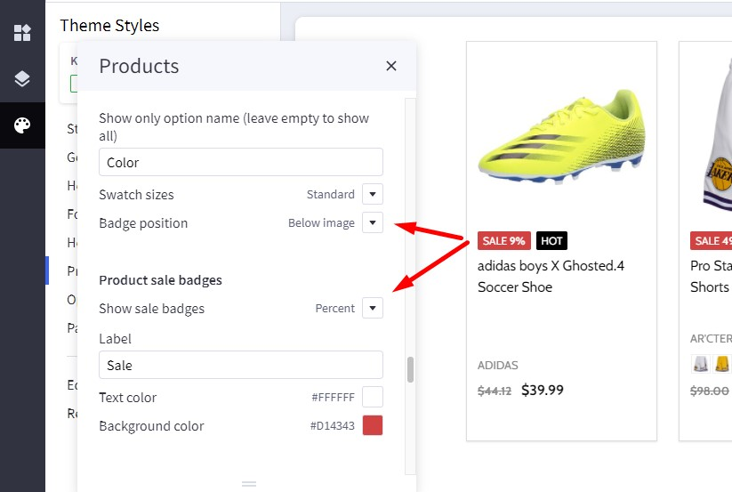

Go to **Page Builder** > **Theme Styles** > **Products** > **Product Page**.

- Tick **Show sale badge** checkbox.
- Tick **Show in-stock badge** checkbox.

### Displaying product image thumbnails vertically or horizontally

**Page Builder** > **Theme Styles** > **Products** > **Product Page**, tick **Show image thumbnails vertically** to display product thumbnails vertically, otherwise it's displayed horizontally.

### Displaying product bulk pricing inline in table

Instead of displaying bulk pricing in a popup modal, you can display it inline by going to **Page Builder** > **Theme Styles** > **Products** > **Product Page**, tick **Show bulk price as table**.

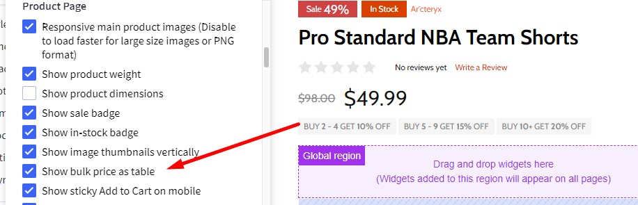

### Displaying sticky Add to Cart button on PDP on mobile

In **Page Builder** > **Theme Styles** > **Products** > **Product Page**, tick **
Show sticky Add to Cart on mobile**.


### Displaying product custom fields in a separated tab

In **Page Builder** > **Theme Styles** > **Products** > **Product Page**:

- Tick **Show custom fields in tab** checkbox.
- Enter the tab title in the next **Tab title** box.

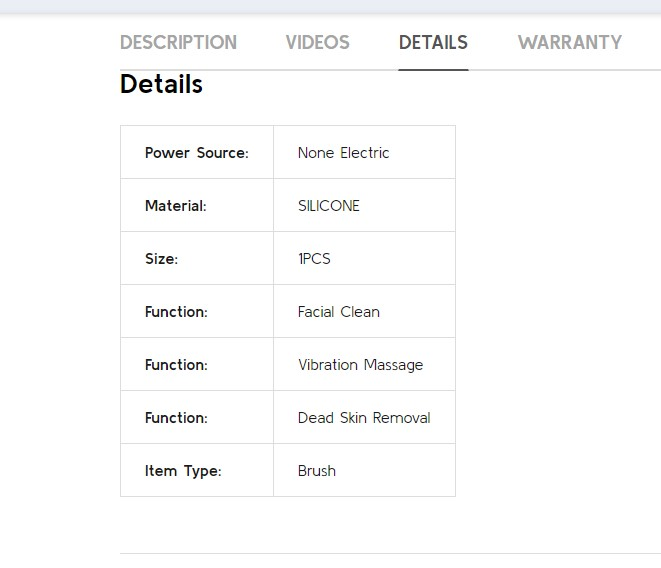

### Displaying Delivery & Returns tab

In **Page Builder** > **Theme Styles** > **Products** > **Product Page**:

- Tick **Show Delivery & Returns tab** checkbox.
- Enter the tab title in the next **Tab title** box.

You can add specific content or global content using BC widgets:

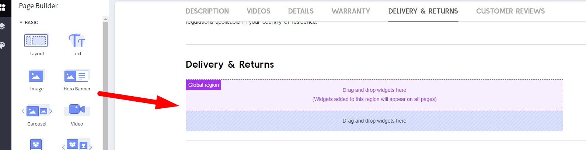


### Numbers of products, reviews, thumbnails

In **Page Builder** > **Theme Styles** > **Products** > **Product Page**:

- **Number of Product Reviews**: Specifying number of product reviews displayed.
- **Number of Related Products**: Specifying number of related products displayed.
- **Number of Customers Also Viewed Products**: Specifying number of customer also viewed products displayed.
- **Number of visible thumbnails**: Specifying number of images displayed in the product thumbnails slider.


### Displaying Swatch Options in the dropdown select box

In **Page Builder** > **Theme Styles** > **Products** > **Swatch display type**:

- Default (Square): Displaying the regular swatches by default.
- Dropdown: Displaying swatches in the dropdown select box.
- Dropdown + Square: Displaying swatches in the dropdown select box in addition to regular swatches.

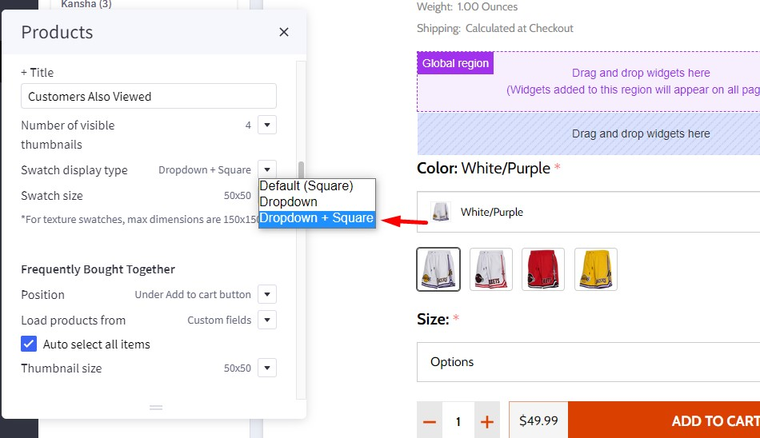


### Displaying Frequently Bought Together Products

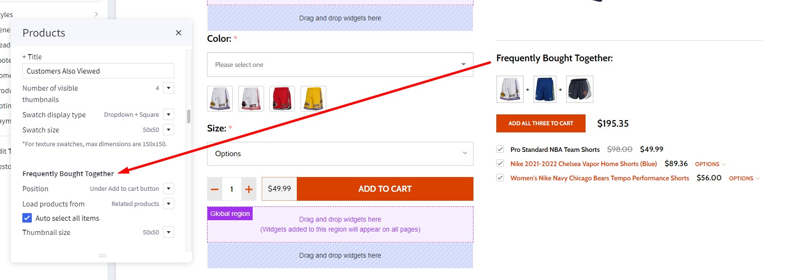

Enabling this feature in **Page Builder** > **Theme Styles** > **Products** > **Frequently Bought Together**, Select **Position** to display it.

- **Load products from**: Specifing products to display here.
  - `Custom fields __alsobought`: Specifying the relevant products in product custom fields with name `__alsobought` and value is the relevant product ID. For example:
  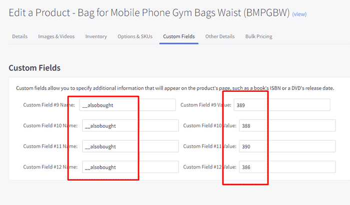
  - `Related products`: Pulling from the related products.
  - `Similar by biews`: Pulling from customer also viewed products.
- **Auto select all items**: Auto select or unselect all frequently bought together products.
- **Thumbnail size**: Specifying the thumbnail image size.
### Configuring swatch dimension

In **Page Builder** > **Theme Styles** > **Products** > **Swatch display type** > Set **Swatch size**.


### Sale badge, Condition badge and custom text badges

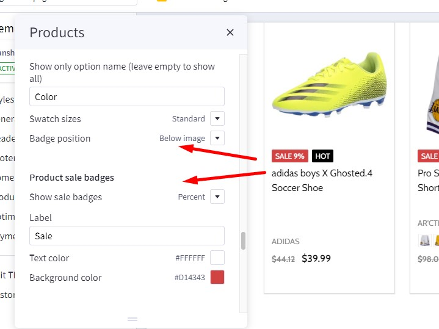

Displaying the sale badge in **Page Builder** > **Theme Styles** > **Products** > **Product sale badges**, tick **Show sale badges**.

- **Label**: Specifying the badge text.
- **Text color**: Specifying the badge text color.
- **Background color**: Specifying the badge background color

Displaying the condition badge in **Condition badges**, tick **Show condition badges**.

Displaying the condition badge in **Custom badges**, tick **Enable custom badge from '__badge' custom field**. Edit product, add custom field with name `__badge` and value is the badge text.

- **Text color**: Specifying the text color of the custom badge.
- **Background color**: Specifying the background color of the custom badge.

### Configuring image sizes


In **Page Builder** > **Theme Styles** > **Products** > **Image Sizes**:

- Main product images: Specifying the main product image size displayed on PDP.
- Thumbnail image: Specifying the product thumbnail size.
- Zoomed image: Specifying the zoomed image size.
- Image in gallery view: Specifying product card image size.


## Customizing Category Pages

Configuring the category pages in **Page Builder** > **Theme Styles** > **Products** > **Category Page**.

### Products Display Type

Theme supports displaying products in grid mode (2, 3, 4 or 6 products per row) or in list mode or bulk order mode. In **Products display type**, select the particular display mode.

- **Show bulk order mode (if select, list mode replaced by bulk order mode)**: if selected, the Bulk Order layout mode will display instead of the regular list mode.

**Grid 6 columns:**

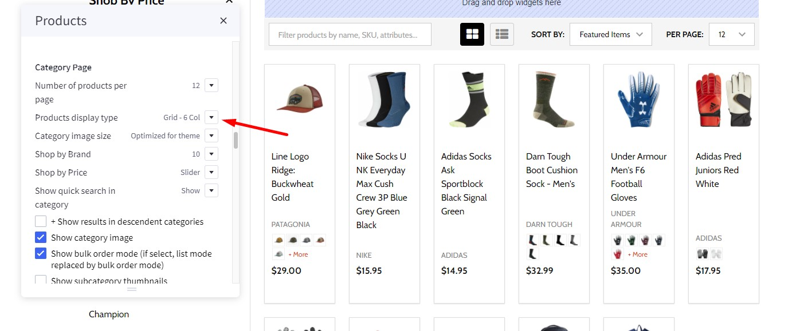

**Bulk Order mode:**

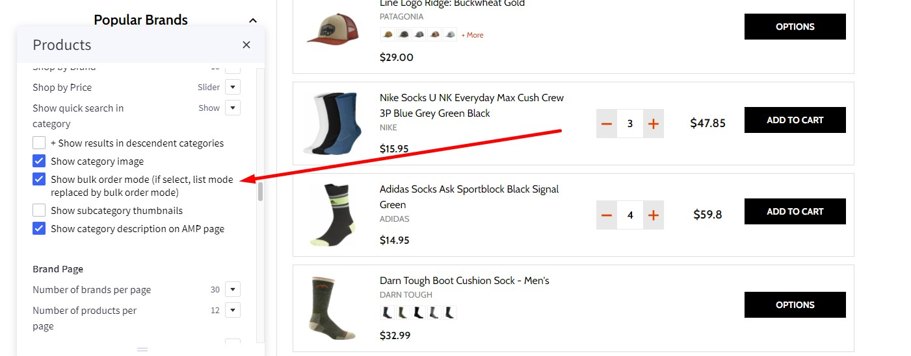

**List mode:**

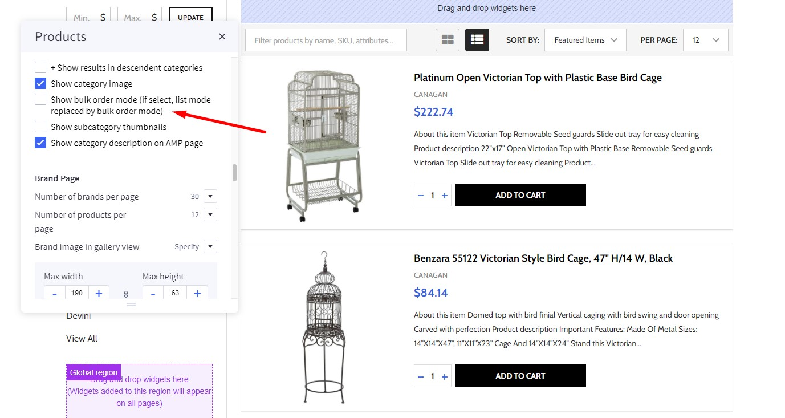


### Displaying Shop by Brand

- **Shop by Brand**: Specifying number of popular brands to display.

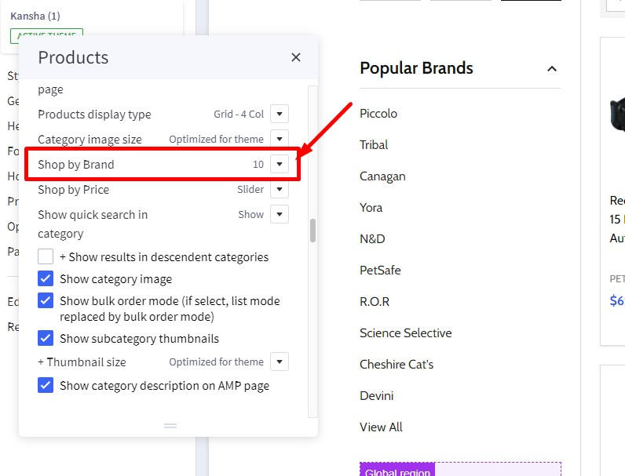

### Displaying Price Slider

- **Shop by Price**:
  - `Slider`: Displaying the price slider.
  - `List`: Displaying price list.
  - `Hide`.

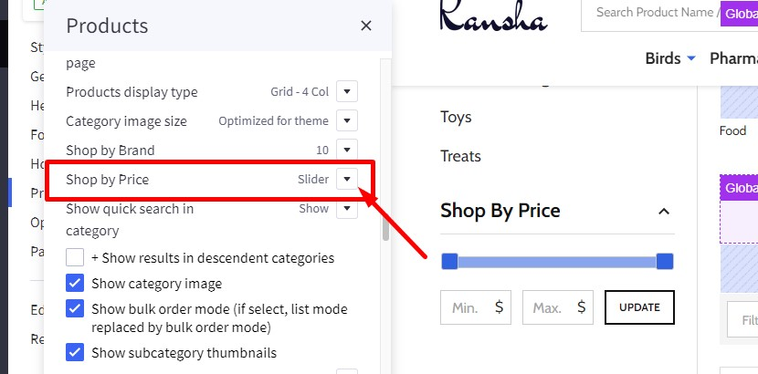

### Display Bulk Order layout

To display this bulk order layout, select **Products display type** = `List`, and tick **Show bulk order mode (if select, list mode replaced by bulk order mode)**.


### Display contextual search

This feature allows searching products within the current category and the current selected filter.


Select **Show quick search in category** = `Show` to enable it.

- **+ Show results in descendent categories**: if selected, it also displays results in the descendent categories.

### Display subcategory image thumbnails

This feature allow displaying subcategory thumbnails before products.

Select **Show subcategory thumbnails** to enable it.


### Common Settings

- **Number of products per page**: Specifying number of products to display per page.
- **Show category image**: Displaying the category image or not.
- **Show category description on AMP page**: Displaying category description on AMP category page or not. If the category content contains images, the AMP page could be invalid. It's recommended to turn off this option.

## Customizing Brand Page & Search Page

Configuring the brand page in **Page Builder** > **Theme Styles** > **Products** > **Brand Page**.

- **Number of brands per page**: Specifying number of brands to display per page.
- **Number of products per page**: Specifying number of products to display per page.
- **Brand image in gallery view**: Specifying the brand card image size.
- **Brand image in brand page**: Specifying the large image size displayed on the brand page.

Configuring the search results page in **Page Builder** > **Theme Styles** > **Products** > **Search results**.

- **Number of products per page**: Specifying number of products to display on the search results page.

### Displaying brand quick-view introduction

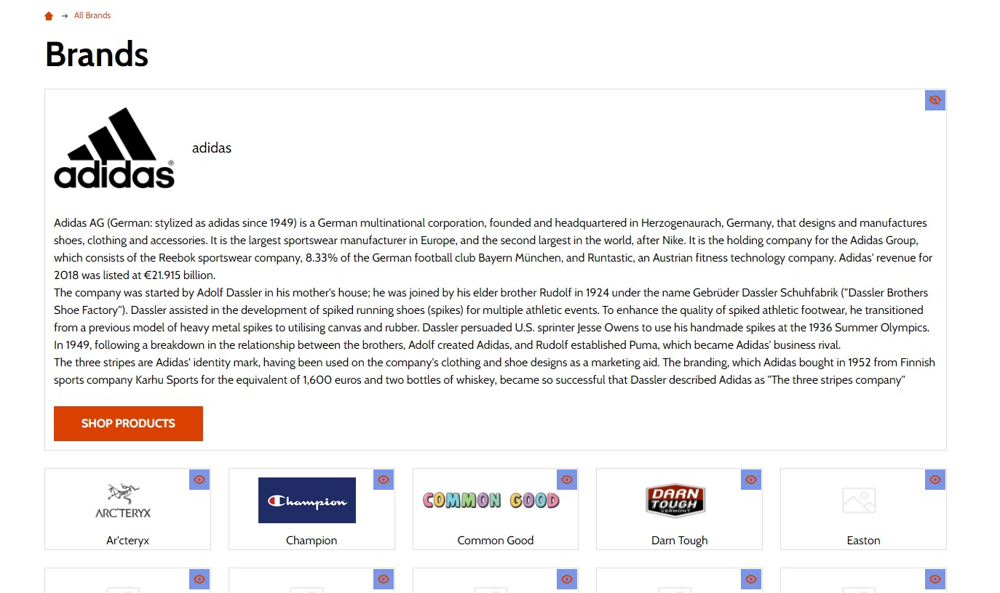

In **Storefront** > **Marketing Banner**, click **Create a Banner** button. 

- Enter the brand introduction content to **Banner Content**.
- Select **Show on Page** = `For a Specific Brand` and select the corresponding brand.
- Select **Location** = `Bottom of Page`.
- Then click **Save** button to finish.

Watch the instruction video:

<iframe width="560" height="315" src="https://www.youtube.com/embed/9Rasj8d5TtM" title="YouTube video player" frameborder="0" allow="accelerometer; autoplay; clipboard-write; encrypted-media; gyroscope; picture-in-picture" allowfullscreen></iframe>


